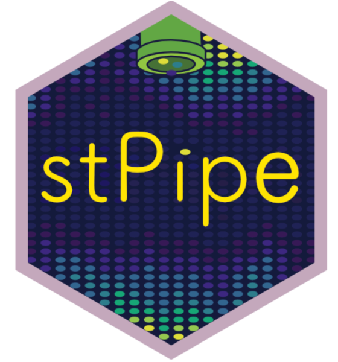

# stPipe



The stPipe package provides a comprehensive pipeline for preprocessing sequencing-based spatial transcriptomics data, including 10X Visium, BGI Stereo-seq, Slide-seq, and Curio-seeker.

The latest development version can be installed with:
```
if (!require("devtools", quietly = TRUE))
    install.packages("devtools")
devtools::install_github("mritchielab/stPipe")

or

if (!require("remotes", quietly = TRUE))
    install.packages("remotes")
remotes::install_github("mritchielab/stPipe")
```

The stPipe vignette can be found using:
```
# stPipe must be installed
browseVignettes("stPipe")
```

Sample 10X Visium data is a downsampled paired-end FASTQ data 10X Visium, probe-based, FFPE mouse spleen sample 709. It can be downloaded from [here](https://zenodo.org/records/14920583), and for detailed sample description please see [here](https://www.biorxiv.org/content/10.1101/2024.03.13.584910v1.abstract).
